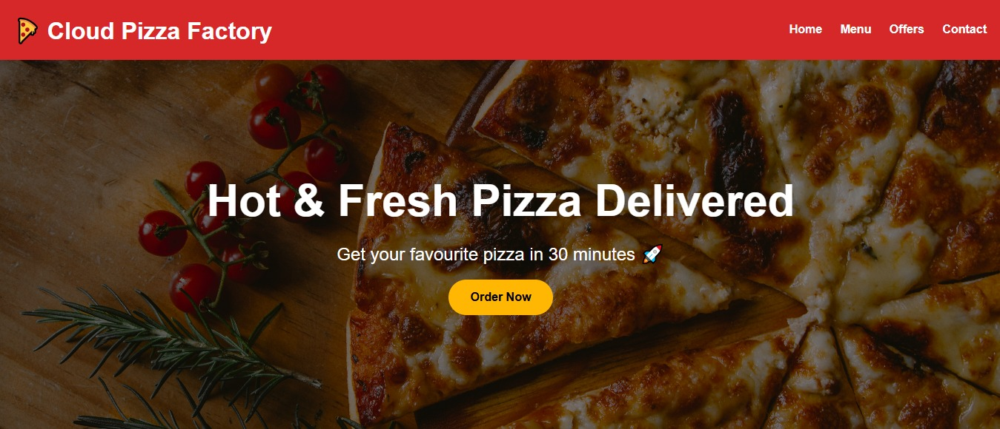
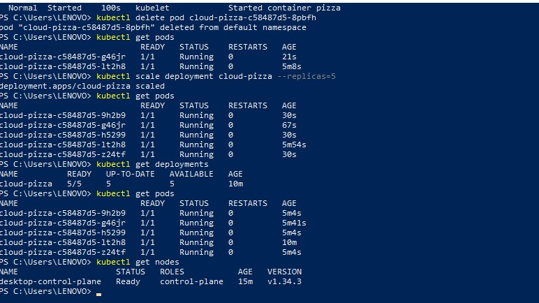

# 🍕 Cloud Pizza Factory

A complete DevOps project demonstrating Docker containerization and Kubernetes orchestration for a Flask web application.

---

## 📖 Project Description

Cloud Pizza Factory is a simple pizza ordering web application built using Python Flask.

The application was first containerized using Docker and then deployed on Kubernetes to demonstrate:

* Containerization
* Deployment Management
* Self-Healing
* Horizontal Scaling
* Cloud Hosting Concepts

---

## 🚀 Technologies Used

| Technology     | Purpose                  |
| -------------- | ------------------------ |
| Python Flask   | Web Application          |
| Docker         | Containerization         |
| Kubernetes     | Container Orchestration  |
| Docker Desktop | Local Kubernetes Cluster |
| AWS EC2        | Cloud Hosting            |
| Git & GitHub   | Version Control          |

---

## 🏗 Architecture

User Browser

↓

AWS EC2

↓

Docker Container

↓

Flask Application

↓

Kubernetes Deployment

↓

Multiple Running Pods

---

## 🐳 Docker Implementation

### Build Docker Image

```bash
docker build -t cloud-pizza .
```

### Run Container

```bash
docker run -d -p 5000:5000 cloud-pizza
```

### Verify Running Container

```bash
docker ps
```

---

## ☸️ Kubernetes Implementation

### Deploy Application

```bash
kubectl apply -f deployment.yaml
```

### Check Deployments

```bash
kubectl get deployments
```

### Check Pods

```bash
kubectl get pods
```

### Check Nodes

```bash
kubectl get nodes
```

---

## 🔄 Self-Healing Demonstration

Deleted a running pod using:

```bash
kubectl delete pod <pod-name>
```

Kubernetes automatically created a new pod to maintain the desired state.

---

## 📈 Scaling Demonstration

Scaled the application from 2 replicas to 5 replicas.

```bash
kubectl scale deployment cloud-pizza --replicas=5
```

Verified using:

```bash
kubectl get pods
```

---

## 🎯 Key Learning Outcomes

* Docker Image Creation
* Docker Container Management
* Kubernetes Cluster Setup
* Deployments and Pods
* Replica Management
* Self-Healing Mechanism
* Horizontal Scaling
* Cloud Deployment Concepts

---

## 📸 Project Screenshots

### Cloud Pizza Website




### Kubernetes Deployment, Scaling and Self-Healing

This screenshot demonstrates:
- Kubernetes Deployment
- Pod Scaling (2 to 5 Replicas)
- Self-Healing Capability
- Running Pods
- Cluster Node Status

## screenshot


---

## 👩‍💻 Author

Priyanka Dalavi

DevOps | Cloud Computing | AWS | Docker | Kubernetes
